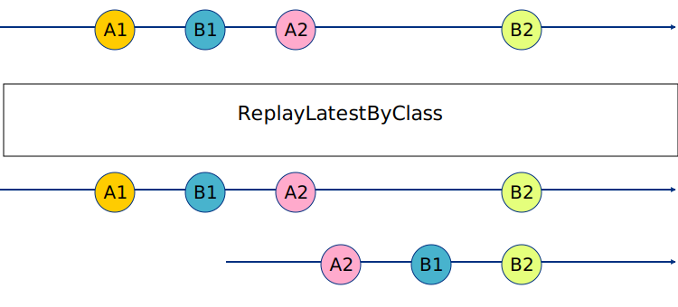

ReplayLatestByClass
===================

`ReplayLatestByClass` is an RxJava 2 transformer which combines a custom version of `replay`, `publish()` and `autoConnect()`.

The version of replay of this transformer replays the latest elements of a certain class type to each new subscriber. The order of the elements emitted at subscribtion is not preserved.



Apply with `compose` to an upstream `Observable` or `Flowable`.
This operator will *not* unsubscribe from upstream opeartors even if the number of subscirptions drops to 0.

Download
--------

Add the following code in your root build.gradle at the end of repositories:

```groovy
allprojects {
    repositories {
        ...
        maven { url 'https://jitpack.io' }
    }
}
```
Add the dependency
```groovy
compile "com.github.ltrojanowski:ReplayLatestByClass:master-SNAPSHOT"
```

License
-------

    Copyright 2017 Łukasz Trojanowski

    Licensed under the Apache License, Version 2.0 (the "License");
    you may not use this file except in compliance with the License.
    You may obtain a copy of the License at

       http://www.apache.org/licenses/LICENSE-2.0

    Unless required by applicable law or agreed to in writing, software
    distributed under the License is distributed on an "AS IS" BASIS,
    WITHOUT WARRANTIES OR CONDITIONS OF ANY KIND, either express or implied.
    See the License for the specific language governing permissions and
    limitations under the License.
